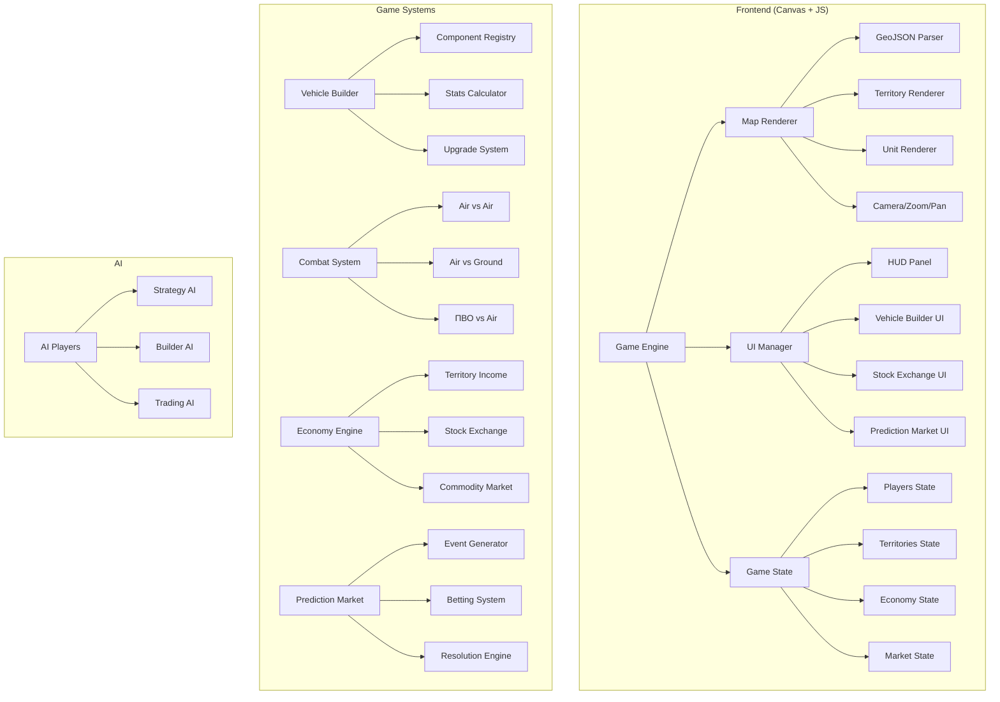

# 🎮 AeroWar — Браузерная военная стратегия

Стратегия реального времени на карте мира с модульным конструктором авиации, ПВО, биржевой торговлей и рынком прогнозов.

---

## Обзор проекта

**Концепция**: Игра в стиле OpenFront.io / War of Dots, но с фокусом на:
1. **Модульный конструктор авиации** — игрок сам проектирует самолёты, вертолёты, истребители из компонентов
2. **Конструктор ПВО** — аналогичная система для зенитных систем
3. **Имена техники** — игрок сам называет свои творения
4. **Модернизация** — возможность апгрейда созданной техники
5. **Биржевая торговля** — акции, золото, нефть с динамикой зависящей от действий игроков
6. **Рынок прогнозов** — ставки на игровые события (нападёт ли игрок A на игрока B)

**Технологии**: HTML5 Canvas + Vanilla JS + Vite (dev server), без фреймворков

---

## Архитектура



---

## User Review Required

> [!IMPORTANT]
> **Однопользовательская vs Многопользовательская**: Первая версия будет **однопользовательская с AI-противниками**. Для полноценного мультиплеера нужен Node.js + WebSocket сервер — это значительно увеличит объём работы. Стоит ли закладывать мультиплеер на будущее?

> [!IMPORTANT]
> **Масштаб карты**: Предлагаю использовать упрощённую карту мира (Natural Earth 110m) с ~180 странами-территориями. Каждая страна = 1 территория. Или нужно делить страны на регионы для большей детализации?

> [!WARNING]
> **Объём проекта**: Это очень масштабная игра. Полная реализация займёт много итераций. Предлагаю начать с **Phase 1–3** (карта + конструктор + бой), а экономику/биржу/прогнозы добавить в следующих фазах.

---

## Proposed Changes

### Phase 1 — Ядро движка и карта мира

#### Структура проекта

```
d:\Игра, ави\
├── index.html                  # Точка входа
├── package.json                # Vite + зависимости
├── vite.config.js              # Конфигурация Vite
├── src/
│   ├── main.js                 # Точка входа приложения
│   ├── engine/
│   │   ├── GameEngine.js       # Основной игровой цикл
│   │   ├── InputManager.js     # Обработка мыши/клавиатуры
│   │   └── Camera.js           # Pan, zoom, проекция
│   ├── map/
│   │   ├── MapRenderer.js      # Рендер карты на Canvas
│   │   ├── Territory.js        # Класс территории
│   │   └── world.geo.json      # Упрощённая карта мира 
│   ├── state/
│   │   ├── GameState.js        # Глобальное состояние
│   │   ├── Player.js           # Игрок (человек/AI)
│   │   └── TerritoryState.js   # Состояние территорий
│   ├── ui/
│   │   ├── UIManager.js        # Менеджер UI элементов
│   │   ├── HUD.js              # Информационная панель
│   │   ├── Sidebar.js          # Боковая панель
│   │   └── Tooltip.js          # Всплывающие подсказки
│   ├── builder/
│   │   ├── VehicleBuilder.js   # Конструктор техники
│   │   ├── components.js       # Каталог компонентов
│   │   ├── StatsCalculator.js  # Расчёт характеристик
│   │   └── UpgradeSystem.js    # Система модернизации
│   ├── combat/
│   │   ├── CombatSystem.js     # Боевая система
│   │   ├── Mission.js          # Боевые миссии
│   │   └── BattleResolver.js   # Разрешение боёв
│   ├── economy/
│   │   ├── EconomyEngine.js    # Экономический движок
│   │   ├── StockExchange.js    # Биржа акций
│   │   ├── CommodityMarket.js  # Рынок сырья
│   │   └── Portfolio.js        # Портфель игрока
│   ├── prediction/
│   │   ├── PredictionMarket.js # Рынок прогнозов
│   │   ├── EventGenerator.js   # Генератор событий
│   │   └── BettingSystem.js    # Система ставок
│   ├── ai/
│   │   ├── AIPlayer.js         # AI противник
│   │   ├── strategies/         # Стратегии AI
│   │   │   ├── Aggressive.js
│   │   │   ├── Defensive.js
│   │   │   └── Economic.js
│   │   └── AITrader.js         # AI биржевой торговец
│   └── utils/
│       ├── constants.js        # Константы и баланс
│       ├── math.js             # Математические утилиты
│       └── colors.js           # Цветовая палитра
└── styles/
    └── index.css               # Стили UI
```

---

#### [NEW] [index.html](file:///d:/Игра,%20ави/index.html)
- HTML5 каркас с canvas на весь экран
- Подключение модулей через Vite
- Overlay UI элементы (HUD, панели)

#### [NEW] [GameEngine.js](file:///d:/Игра,%20ави/src/engine/GameEngine.js)
- `requestAnimationFrame` игровой цикл (60 FPS)
- Управление состоянием игры: `MENU → PLAYING → PAUSED`
- Тиковая система (игровое время, скорость x1/x2/x4)
- Координация всех подсистем

#### [NEW] [Camera.js](file:///d:/Игра,%20ави/src/engine/Camera.js)
- Pan (перетаскивание карты мышью)
- Zoom (колёсико мыши, pinch на тачскрине)
- Меркаторова проекция GeoJSON → Canvas координаты
- Плавная анимация перемещения

#### [NEW] [MapRenderer.js](file:///d:/Игра,%20ави/src/map/MapRenderer.js)
- Парсинг GeoJSON (Natural Earth 110m)
- Рендер полигонов стран с заливкой цветом владельца
- Границы территорий
- Hover-эффект + клик для выбора территории
- Point-in-polygon детекция для кликов

#### [NEW] [Territory.js](file:///d:/Игра,%20ави/src/map/Territory.js)
- Модель территории: `{ id, name, owner, resources, buildings, units }`
- Типы ресурсов: нефть, руда, золото, население
- Доход в зависимости от ресурсов
- Смежность территорий (для правил атаки)

---

### Phase 2 — Конструктор авиации и ПВО

#### Система компонентов

Авиация строится из модулей, каждый влияет на характеристики:

| Категория | Компоненты | Влияние |
|---|---|---|
| **Фюзеляж** | Лёгкий / Средний / Тяжёлый / Стелс | Вес, прочность, вместимость слотов |
| **Двигатель** | Поршневой / Турбовинтовой / Реактивный / Турбовальный (вертолёт) | Скорость, расход топлива, тяга |
| **Крылья** | Прямые / Стреловидные / Дельта / Несущий винт | Манёвренность, подъёмная сила, тип воздушного судна |
| **Вооружение** | Пулемёты / Пушки / Ракеты "воздух-воздух" / Бомбы / Ракеты "воздух-земля" | Урон, дальность, вес |
| **Защита** | Без брони / Лёгкая / Тяжёлая / Композитная | Защита, вес |
| **Электроника** | Базовый радар / Продвинутый / АВАКС / РЭБ | Обнаружение, РЭБ, вес, стоимость |
| **Спецоборудование** | Допбаки / Ловушки / Стелс-покрытие | Дальность, выживаемость |

**Типы техники определяются выбором компонентов:**
- Несущий винт → **Вертолёт**
- Прямые крылья + Поршневой → **Лёгкий самолёт / Штурмовик**
- Стреловидные + Реактивный → **Истребитель**
- Тяжёлый фюзеляж + Бомбы → **Бомбардировщик**
- АВАКС → **Самолёт ДРЛО**

**ПВО строится аналогично:**

| Категория | Компоненты | Влияние |
|---|---|---|
| **Шасси** | Стационарный / Колёсный / Гусеничный | Мобильность, прочность, стоимость |
| **Радар** | Ближний / Средний / Дальний / Фазированная решётка | Дальность обнаружения, точность |
| **Ракеты** | Малой / Средней / Большой дальности | Урон, дальность, скорострельность |
| **Пушки** | Зенитная / Скорострельная / Автоматическая | Урон ближний бой, скорострельность |
| **Системы** | ИК-наведение / Радиолокационное / Командное | Точность, помехозащищённость |
| **Защита** | Камуфляж / Бронирование / РЭБ | Выживаемость |

#### [NEW] [VehicleBuilder.js](file:///d:/Игра,%20ави/src/builder/VehicleBuilder.js)
- UI конструктора: drag-and-drop компонентов в слоты
- Визуализация собираемой техники (схематичная)
- Расчёт характеристик в реальном времени
- Валидация совместимости компонентов
- Поле ввода пользовательского имени
- Сохранение созданных проектов

#### [NEW] [components.js](file:///d:/Игра,%20ави/src/builder/components.js)
- Полный каталог всех компонентов с характеристиками
- Дерево технологий (что нужно исследовать для доступа)
- Стоимость и время производства

#### [NEW] [StatsCalculator.js](file:///d:/Игра,%20ави/src/builder/StatsCalculator.js)
- Формулы расчёта итоговых характеристик
- Синергии и конфликты компонентов
- Сравнение вариантов техники

#### [NEW] [UpgradeSystem.js](file:///d:/Игра,%20ави/src/builder/UpgradeSystem.js)
- Модернизация существующей техники
- Замена компонентов на улучшенные
- Стоимость и время модернизации
- Сохранение опыта юнита при апгрейде

---

### Phase 3 — Боевая система

#### [NEW] [CombatSystem.js](file:///d:/Игра,%20ави/src/combat/CombatSystem.js)
Пошаговое разрешение боёв:
1. **Обнаружение**: Радары ПВО и ДРЛО обнаруживают противника
2. **Перехват**: Истребители поднимаются на перехват
3. **Воздушный бой**: Манёвренность vs Манёвренность, Оружие vs Защита
4. **Прорыв ПВО**: Авиация vs зенитные системы
5. **Удар по цели**: Бомбардировщики/штурмовики атакуют
6. **Результат**: Потери, урон инфраструктуре, захват территории

#### [NEW] [Mission.js](file:///d:/Игра,%20ави/src/combat/Mission.js)
- Типы миссий: Патруль / Перехват / Бомбардировка / Разведка / Десант
- Назначение техники на миссии
- Расчёт расхода топлива и боеприпасов

---

### Phase 4 — Экономика и биржа

#### [NEW] [EconomyEngine.js](file:///d:/Игра,%20ави/src/economy/EconomyEngine.js)
- Доход с территорий (население → налоги, ресурсы → экспорт)
- Расходы (содержание армии, производство, исследования)
- Инфляция и дефляция в зависимости от действий

#### [NEW] [StockExchange.js](file:///d:/Игра,%20ави/src/economy/StockExchange.js)
Полноценная **биржа** со следующими инструментами:

| Инструмент | Описание | Что влияет на цену |
|---|---|---|
| **Акции стран** | Акции каждого игрока | Территория, армия, экономика игрока |
| **Нефть** | Баррель нефти | Контроль нефтяных регионов, войны |
| **Золото** | Унция золота | Нестабильность, войны (safe haven) |
| **Металлы** | Сталь, алюминий | Производство техники, спрос |
| **Продовольствие** | Зерно | Контроль с/х регионов, население |
| **Оружие** | Индекс вооружений | Количество конфликтов |

**Механика цен:**
- Базовая цена + отклонения от действий игроков
- Спрос/предложение (если все покупают нефть → цена растёт)
- Игровые события (война → нефть↑, золото↑, акции↓)
- Случайные события (стихийные бедствия, открытия)

**Торговый UI:**
- Графики цен (свечные, линейные)
- Ордера: купить / продать / лимитный ордер
- Портфель игрока с PnL
- История сделок

#### [NEW] [CommodityMarket.js](file:///d:/Игра,%20ави/src/economy/CommodityMarket.js)
- Симуляция спроса/предложения
- Ценообразование с шумом (Brownian motion)
- Влияние войн и событий на цены
- AI трейдеры для ликвидности

---

### Phase 5 — Рынок прогнозов (Polymarket)

#### [NEW] [PredictionMarket.js](file:///d:/Игра,%20ави/src/prediction/PredictionMarket.js)
- UI рынка прогнозов в стиле Polymarket
- Бинарные контракты (Да/Нет): например «Нападёт ли Игрок А на Игрока Б до конца хода 20?»
- Цена контракта = вероятность (0.01 — 0.99)
- Покупка/продажа контрактов
- Автоматическое разрешение (settlement) при наступлении/ненаступлении события

#### [NEW] [EventGenerator.js](file:///d:/Игра,%20ави/src/prediction/EventGenerator.js)
Генерация случайных событий для рынка прогнозов:

| Категория | Примеры событий |
|---|---|
| **Военные** | «Нападёт ли X на Y?», «Будет ли захвачена территория Z?» |
| **Экономические** | «Цена нефти превысит $100?», «Игрок X обанкротится?» |
| **Дипломатические** | «Будет ли заключён союз X-Y?», «Нарушит ли X перемирие?» |
| **Производство** | «Создаст ли X более 10 истребителей?» |

- Генерация на основе текущего состояния игры
- Таймер разрешения (через N ходов)
- Оценка начальной вероятности на основе AI расчётов

---

### Phase 6 — AI противники

#### [NEW] [AIPlayer.js](file:///d:/Игра,%20ави/src/ai/AIPlayer.js)
- 3 типа стратегий: Агрессивный / Оборонительный / Экономический
- Автоматическое проектирование техники
- Принятие решений по атаке/обороне
- Торговля на бирже
- Ставки на прогнозы

---

## Дизайн и UX

### Визуальный стиль
- **Тёмная тема** с неоновыми акцентами (военная эстетика)
- Карта в стиле «ночной вид со спутника» — тёмный фон океанов, подсвеченные территории
- Цвета фракций: яркие неоновые (красный, синий, зелёный, оранжевый, фиолетовый)
- Glassmorphism для UI панелей
- Шрифт: `Rajdhani` или `Orbitron` (милитари/sci-fi стиль)

### Макет интерфейса

```
┌──────────────────────────────────────────────────────────┐
│  💰 $12,450  │  🛩 12/20  │ 🎯 3 ПВО  │  ⏱ Ход 15  │ ⚙  │  ← Верхний HUD
├──────────────┬───────────────────────────────────────────┤
│              │                                           │
│   Боковая    │                                           │
│   панель     │          [КАРТА МИРА]                      │
│              │                                           │
│  📋 Армия    │     Территории с цветами игроков          │
│  🔧 Строить  │     Иконки юнитов                         │
│  📊 Биржа    │     Линии атак                            │
│  🎲 Прогнозы │                                           │
│  ⚔ Атака     │                                           │
│              │                                           │
├──────────────┴──────────┬────────────────────────────────┤
│  Мини-карта             │  Лог событий / Новости биржи   │
└─────────────────────────┴────────────────────────────────┘
```

---

## Open Questions

> [!IMPORTANT]
> 1. **Название игры**: Предлагаю «AeroWar» или «SkyFront». Есть ли предпочтения?

> [!IMPORTANT]
> 2. **Мультиплеер**: Начинаем с однопользовательской с AI, или сразу закладываем серверную архитектуру для мультиплеера?

> [!IMPORTANT]
> 3. **Сложность карты**: 
>    - Вариант А: ~180 стран (простая, как OpenFront.io)
>    - Вариант Б: ~500 регионов (страны разбиты на области)
>    - Вариант В: Сетка гексов поверх реальной карты

> [!IMPORTANT]  
> 4. **Приоритет фаз**: Хотите начать с Phase 1-3 (карта + конструктор + бой), а биржу/прогнозы добавить позже? Или хотите сразу всё?

---

## Verification Plan

### Automated Tests
- Запуск `npm run dev` и проверка в браузере
- Тестирование рендера карты (все страны отображаются)
- Тестирование камеры (zoom/pan работают плавно)
- Тестирование конструктора (компоненты совместимы, характеристики считаются)
- Тестирование боёв (результаты логичны)
- Тестирование биржи (цены реагируют на события)

### Manual Verification
- Визуальная проверка в браузере через browser subagent
- Запись видео геймплея
- Проверка FPS (должен быть стабильно 60)
- Тестирование на разных разрешениях экрана
